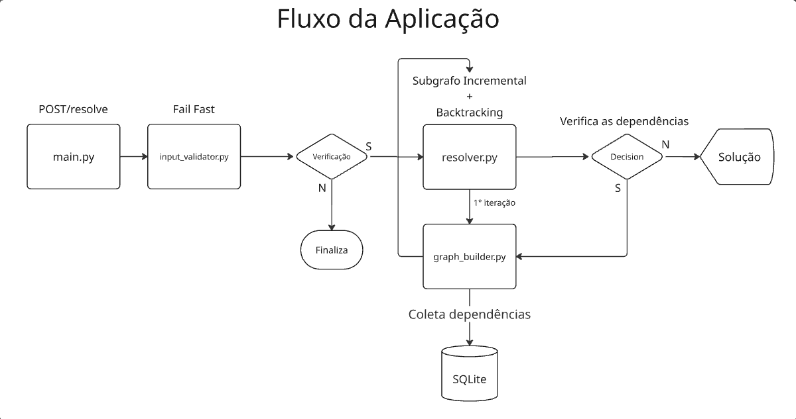

# Resolvedor de Dependências para Bibliotecas Python

## Descrição
Este projeto tem como objetivo desenvolver um resolvedor de dependências para bibliotecas Python, sugerindo os pacotes corretos para que o usuário consiga montar um ambiente virtual com versões compatíveis, sem conflitos e com informações claras sobre pacotes problemáticos.

O resolvedor analisa:
* Pacotes com versão fixa
* Intervalos e restrições de versão
* Pacotes sem versões especificadas

O sistema utiliza dados reais do PyPI e resolve dependências usando as técnicas Backtracking + Poda + Heurísticas.

---

## Arquitetura e Fluxo

Abaixo, o diagrama ilustra como o sistema processa uma requisição, desde a entrada do usuário até a resolução final das versões.



1.  **Entrada e Validação:**
    O `main.py` recebe a requisição (`POST /resolve`) e aciona o `InputValidator`. Ele normaliza os nomes (ex: "Pandas" vira "pandas") e verifica imediatamente no banco se os pacotes existem. Se não existirem, o processo para aqui (*Fail Fast*).

2.  **Resolução:**
    O `Resolver` utiliza um algoritmo de **Backtracking**. Ele gerencia uma lista de tarefas e escolhe qual pacote resolver primeiro, tentando encontrar uma combinação válida.

3.  **Exploração:**
    O `GraphBuilder` atua como intermediário entre o Resolver e os dados. Ele consulta o banco (`db_client`), filtra versões incompatíveis (como aquelas que não suportam a versão do Python solicitada ou estão marcadas como *yanked*) e entrega apenas candidatos válidos ao Resolver.

4.  **Expansão e Decisão:**
    Ao escolher uma versão de um pacote, o Resolver pede as dependências dele. Se houver conflito entre requisitos, o sistema realiza o *backtrack* (desfaz a escolha atual e tenta a próxima versão disponível). Se a lista de tarefas for concluída sem erros, a solução é devolvida.

---

## Requisitos
* Python 3.10 ou superior
* SQLite3
* Dataset PyPI (fornecido no repositório)
* Docker e Docker Compose (para execução containerizada)

---

## Passo a Passo de Execução

Para executar o projeto, você pode escolher entre utilizar uma base de dados pré-processada (execução rápida) ou construir a base do zero. Siga as instruções abaixo:

### 1. Configuração da Base de Dados

**Opção A: Execução Rápida (Recomendado)**
Se deseja iniciar a aplicação rapidamente, baixe o dataset pré-processado:
1. Faça o download do arquivo `.zip` através deste link: [LINK DO DRIVE](https://drive.google.com/drive/folders/1ZqvOu022HgDVcafCKbKbks3cJkBscttT?usp=sharing)
2. Extraia o arquivo `.sqlite` contido no zip.
3. Mova o arquivo extraído para a pasta `data` dentro do diretório do projeto.
   > **Atenção:** Mantenha exatamente o mesmo nome do arquivo `.sqlite` extraído.

**Opção B: Configuração Completa (Via Script)**
Caso opte por não baixar o arquivo `.zip`, a aplicação executará automaticamente um script de setup.
* O sistema fará a busca e limpeza dos dados diretamente da fonte.
* **Aviso:** Este processo leva em média **22 minutos** para ser concluído.

Aqui está o Markdown bruto corrigido, com a formatação da lista e do bloco de código ajustada:

````markdown
### 2. Executando a Aplicação

Certifique-se de que o **Docker Desktop** esteja instalado e em execução na sua máquina.

1. No seu terminal (ambiente), execute o comando para construir e subir os containers:
   ```bash
   docker-compose up --build
````

## Links úteis

  * [Dataset PyPI](https://github.com/pypi-data/pypi-json-data/tree/main?tab=readme-ov-file)
  * [Documentação PyPI](https://pypi.org/)
  * [Tutorial sobre ambientes virtuais Python](https://docs.python.org/3/tutorial/venv.html)

<!-- end list -->

